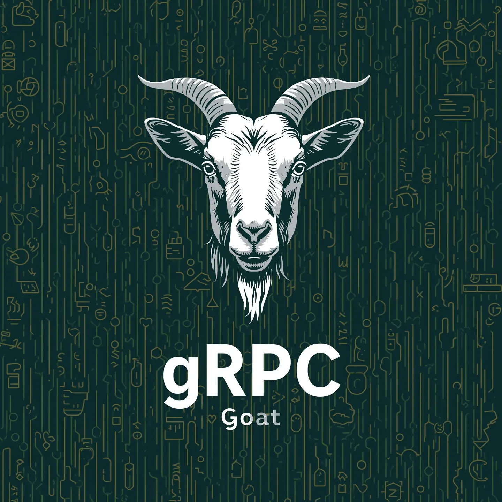

import { Aside } from 'astro-pure/user'

# Installation & Getting Started

Welcome to gRPC Goat! This guide will help you set up your lab environment and run your first vulnerability test.

<Aside type="tip">
**Quick Start**: If you're familiar with Docker, jump to the [Quick Commands](#quick-commands) section to get started immediately.
</Aside>



## Prerequisites

Before you begin, ensure you have the following tools installed on your system:

### Required Tools

1. **Docker & Docker Compose**
   - Docker Engine 20.10+ or Docker Desktop
   - Docker Compose V2 (comes with Docker Desktop)
   - [Download Docker](https://docs.docker.com/get-docker/)

2. **grpcurl** (for testing gRPC services)
   ```bash
   # Install via Go
   go install github.com/fullstorydev/grpcurl/cmd/grpcurl@latest

   # Or via Homebrew (macOS)
   brew install grpcurl

   # Or via package manager (Ubuntu/Debian)
   sudo apt-get install grpcurl

   # Or download binary from GitHub releases
   # https://github.com/fullstorydev/grpcurl/releases
   ```

3. **Protocol Buffer Files** (for labs 002-009)
   - All required `.proto` files are provided in the `protos/` directory
   - Lab 001 uses gRPC reflection, so no proto file is needed
   - See `protos/README.md` for usage instructions

### Additional gRPC Testing Tools

**Command Line Tools:**
- **grpcurl** - Command-line tool for interacting with gRPC services
- **ghz** - gRPC benchmarking and load testing tool
- **evans** - Interactive gRPC client with REPL interface

**GUI Applications:**
- **Postman** - Popular API client with gRPC support (v8.5.0+)
- **BloomRPC** - Cross-platform gRPC client with GUI interface
- **Kreya** - Modern gRPC and REST API client
- **Insomnia** - API client with gRPC support

### Optional Tools

- **Go 1.21+** (if you want to build from source)
- **Git** (for cloning the repository)

## Installation

### Option 1: Clone from GitHub (Recommended)

```bash
# Clone the repository
git clone https://github.com/rootxjs/grpc-goat.git
cd grpc-goat

# Verify the setup
ls labs/  # Should show 9 lab directories
```

### Option 2: Download Release

Download the latest release from the [GitHub releases page](https://github.com/rootxjs/grpc-goat/releases) and extract it.

## Quick Commands

### Start All Labs at Once

```bash
# Start all 9 vulnerable services
docker compose up --build

# Run in background (detached mode)
docker compose up --build -d

# View logs
docker compose logs -f
```

### Start Individual Labs

```bash
# Example: Start only Lab 001 (gRPC Reflection)
cd labs/grpc-001-reflection-enabled
docker build -t grpc-001 .
docker run -p 8001:8001 grpc-001
```

## Service Endpoints

Once running, the labs will be available on the following ports:

| Lab | Service | Port | Description |
|-----|---------|------|-------------|
| **001** | Service Discovery | `localhost:8001` | gRPC Reflection vulnerability |
| **002** | Auth Service | `localhost:8002` | Plaintext gRPC communications |
| **003** | Billing Service | `localhost:8003` | Insecure TLS implementation |
| **004** | Partner API | `localhost:8004` | Arbitrary mTLS acceptance |
| **005** | Partner API v2 | `localhost:8005` | mTLS with subject validation bypass |
| **006** | Admin Service | `grpc-006 container` | Unix socket with world permissions |
| **007** | User Directory | `localhost:8007` | SQL injection vulnerability |
| **008** | File Processor | `localhost:8008` | Command injection vulnerability |
| **009** | Image Preview | `localhost:8009` | Server-Side Request Forgery (SSRF) |

## Your First Lab: Lab 001 - gRPC Reflection

Let's walk through your first vulnerability test to ensure everything is working correctly.

### Step 1: Start Lab 001

```bash
# Start Lab 001 specifically
docker compose up grpc-001 --build
```

Wait for the message: `gRPC server listening on :8001`

### Step 2: Test the Service

```bash
# Discover available services (this is the vulnerability!)
grpcurl -plaintext localhost:8001 list

# Expected output:
# grpc.reflection.v1alpha.ServerReflection
# servicediscovery.ServiceDiscovery
```

### Step 3: Exploit the Vulnerability

```bash
# List methods in the service
grpcurl -plaintext localhost:8001 list servicediscovery.ServiceDiscovery

# Expected output:
# servicediscovery.ServiceDiscovery.AdminListAllServices
# servicediscovery.ServiceDiscovery.ListServices
```

### Step 4: Capture Your First Flag

```bash
# Call the hidden admin method
grpcurl -plaintext -d '{"admin_token": "fake"}' \
  localhost:8001 servicediscovery.ServiceDiscovery/AdminListAllServices
```

**Congratulations!** You should see a response containing your first flag: `GRPC_GOAT{reflection_enabled_service_discovery}`

## Testing Other Labs

For labs 002-009, you'll need to use the corresponding proto files from the `protos/` directory:

```bash
# Example: Lab 002 - Auth Service
grpcurl -plaintext -proto protos/lab-002-auth.proto \
  -d '{"username": "admin", "password": "password"}' \
  localhost:8002 auth.AuthService/Login

# Example: Lab 007 - SQL Injection
grpcurl -plaintext -proto protos/lab-007-user-directory.proto \
  -d '{"username": "admin"}' \
  localhost:8007 userdirectory.UserDirectory/SearchUsers
```

<Aside type="note">
**Proto Files**: Each lab (except 001) requires its corresponding proto file for client interaction. All proto files are available in the `protos/` directory with detailed usage examples.
</Aside>

## Next Steps

Now that you have your environment set up and have captured your first flag:

1. **Learn gRPC Fundamentals**: If you're new to gRPC, check out the [gRPC Basics](/docs/grpc_goat_docs/grpc-basics) guide
2. **Explore More Labs**: Check out the [Labs Overview](/docs/grpc_goat_docs/labs) to see all 9 vulnerabilities
3. **Follow the Walkthrough**: Use the [Walkthrough Guide](/docs/grpc_goat_docs/walkthrough) for step-by-step exploitation instructions
4. **Learn the Mitigations**: Each lab includes security best practices to prevent these vulnerabilities
5. **Practice with Different Tools**: Try using Postman, BloomRPC, or other gRPC clients to interact with the services

<Aside type="note">
**CTF-Style Learning**: Each lab contains a unique flag that you can capture by successfully exploiting the vulnerability. This gamified approach makes learning gRPC security both engaging and practical.
</Aside>

Ready to dive deeper? Head to the [Walkthrough Guide](/docs/grpc_goat_docs/walkthrough) to learn how to exploit all 9 vulnerabilities!
